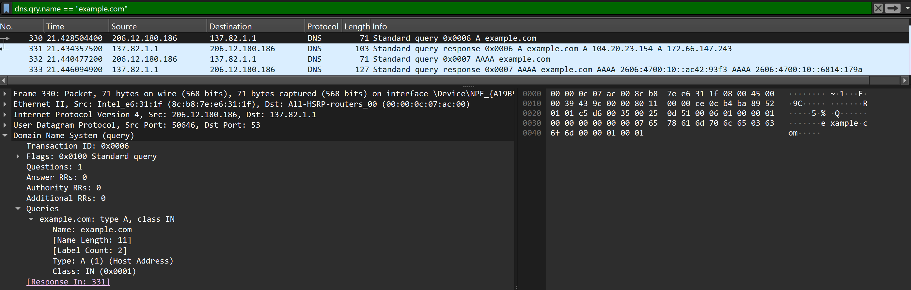
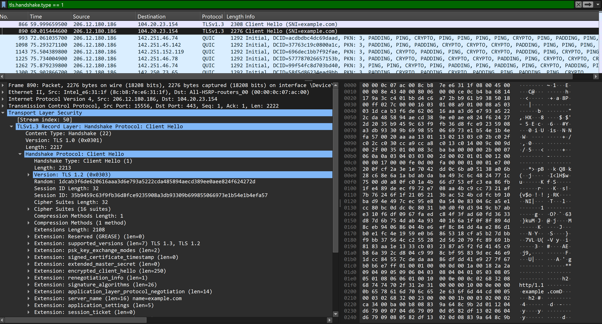
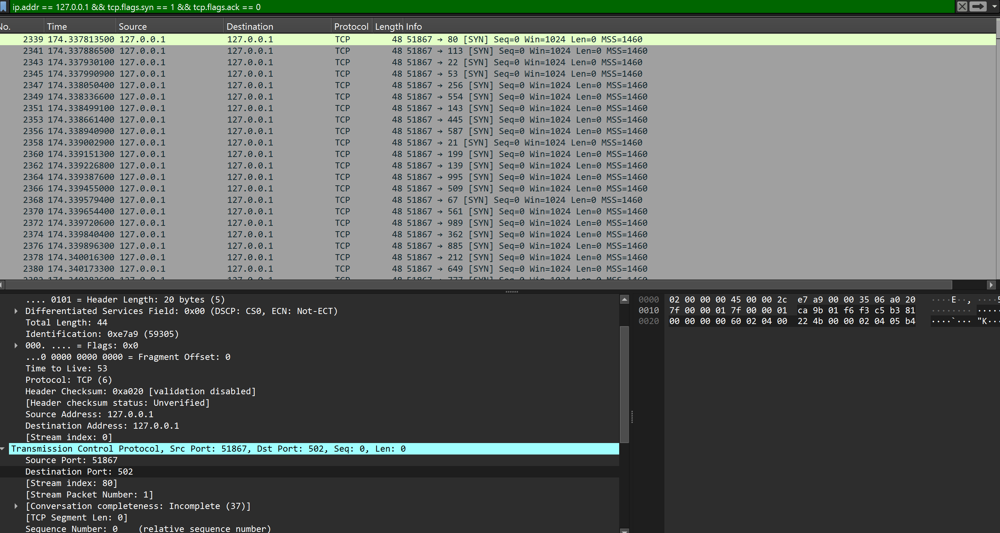

# Network Traffic Analysis with Wireshark

## Overview

This project investigates normal and security-relevant network traffic in a controlled Windows 11 lab environment. Wireshark was used to capture and analyze DNS resolution, encrypted HTTPS traffic, an intentionally insecure HTTP form submission, and a TCP SYN port scan.

The purpose was to practice a repeatable network-investigation workflow: establish a baseline, isolate relevant packets, examine protocol behavior, identify security concerns, and document the findings clearly.

All active testing was limited to `127.0.0.1`, the local computer. No third-party systems were scanned.

## Objectives

* Capture and analyze DNS queries and responses
* Examine how HTTPS protects application data using TLS
* Demonstrate how HTTP exposes submitted information in plaintext
* Identify the packet pattern produced by a TCP SYN scan
* Practice using Wireshark filters and stream reconstruction
* Document findings in an investigation-style report

## Lab Environment

| Component             | Details                 |
| --------------------- | ----------------------- |
| Operating system      | Windows 11              |
| Packet analyzer       | Wireshark 4.6.8         |
| Packet capture driver | Npcap                   |
| Scanner               | Nmap 7.991              |
| Local web server      | Python 3.10.0           |
| HTTP endpoint         | `http://127.0.0.1:8000` |
| Scan target           | `127.0.0.1` only        |

## Investigation Workflow

1. Captured Internet traffic on the active Wi-Fi interface.
2. Generated controlled DNS queries using `nslookup`.
3. Visited HTTPS websites to observe encrypted TLS traffic.
4. Hosted an intentionally insecure HTTP login form on localhost.
5. Submitted fake demonstration credentials over HTTP.
6. Performed an Nmap SYN scan against localhost.
7. Used Wireshark display filters to isolate and investigate each activity.
8. Exported limited evidence captures containing only controlled lab traffic.

## Finding 1: DNS Query and Response

**Display filter:**

```text
dns.qry.name == "example.com"
```



The capture shows a DNS query requesting the IP address associated with `example.com`, followed by a response from the configured DNS resolver. This represents expected name-resolution activity that occurs before a client connects to a service by domain name.

The query and response can be correlated using their transaction ID, queried domain, timestamps, and source and destination addresses.

**Key observations:**

* Queried domain: `example.com`
* Query type: `A`
* Query packet: `330`
* Response packet: `331`
* Resolved address: `206.12.180.186`
* DNS server: `137.82.1.1`

Security relevance: DNS logs can help analysts identify unusual domains, unexpected external destinations, repeated failed lookups, and possible command-and-control activity. A DNS request alone does not prove malicious activity and must be evaluated in context.

## Finding 2: Encrypted HTTPS Traffic

**Display filter:**

```text
tls.handshake.type == 1
```



The capture contains a TLS handshake initiated while visiting a normal HTTPS website. Wireshark could identify protocol metadata and encrypted application data, but it could not display the webpage contents or submitted information in plaintext.

**Key observations:**

* Transport security protocol: TLS
* Client Hello packet: `866`
* Destination: `104.20.23.154`
* Application content readable in plaintext: No

**Security relevance:** Encryption protects application content from passive observation. However, metadata such as IP addresses, connection timing, packet sizes, and sometimes domain-related handshake information may still be available to an analyst.

## Finding 3: Plaintext HTTP Form Submission

**Display filter:**

```text
http.request.method == "POST"
```


An intentionally insecure login form was hosted locally at `127.0.0.1:8000`. The form was submitted using fake demonstration credentials:

```text
username=myusername&password=mypassword818
```

Following the HTTP stream revealed the submitted values directly inside the request body because HTTP did not provide transport encryption.

**Key observations:**

* HTTP method: `POST`
* Request path: `/login`
* Destination port: `8000`
* POST packet: `441`
* Encryption: None
* Credentials visible: Yes, using controlled fake values

**Risk:** If sensitive information is transmitted over HTTP, anyone capable of observing traffic along the network path may be able to read or modify it.

**Recommendation:** Applications handling credentials or other sensitive information should require HTTPS, redirect HTTP requests to HTTPS, and use appropriate TLS and HSTS configurations.

## Finding 4: TCP SYN Scan

The controlled scan was performed using:

```powershell
nmap -sS -Pn -p 1-1000,8000 --reason 127.0.0.1
```

**Display filter:**

```text
ip.addr == 127.0.0.1 && tcp.flags.syn == 1 && tcp.flags.ack == 0
```



The capture shows numerous TCP SYN packets targeting different destination ports on localhost within a short period. This pattern is consistent with TCP port enumeration.

Closed ports responded differently from the open local web-server port. Port `8000` responded with `SYN, ACK` while the server was running, allowing Nmap to identify it as open.

**Key observations:**

* Source address: `127.0.0.1`
* Destination address: `127.0.0.1`
* Scan type: TCP SYN scan
* Port range: `1-1000,8000`
* Known open test port: `8000`
* Scan start time: `174.336088800`
* Scan duration: `19.2114953`

**Security relevance:** A burst of connection attempts across many destination ports can indicate reconnaissance. Port scanning is not automatically malicious, so analysts should correlate it with authorization, asset information, source reputation, timing, traffic volume, and subsequent activity.

## Comparison of Observed Traffic

| Activity       | Expected pattern                         | Security significance                        |
| -------------- | ---------------------------------------- | -------------------------------------------- |
| DNS resolution | Query followed by a response             | Useful for identifying contacted domains     |
| HTTPS/TLS      | Handshake followed by encrypted data     | Protects application content                 |
| HTTP POST      | Request content visible in plaintext     | Sensitive values may be exposed              |
| SYN scan       | Many SYN packets sent to different ports | Possible reconnaissance or service discovery |

## Useful Wireshark Filters

| Purpose                  | Display filter                                                     |
| ------------------------ | ------------------------------------------------------------------ |
| All DNS traffic          | `dns`                                                              |
| Query for example.com    | `dns.qry.name == "example.com"`                                    |
| TLS Client Hello         | `tls.handshake.type == 1`                                          |
| QUIC traffic             | `quic`                                                             |
| Local HTTP demonstration | `tcp.port == 8000`                                                 |
| HTTP POST requests       | `http.request.method == "POST"`                                    |
| Initial SYN packets      | `tcp.flags.syn == 1 && tcp.flags.ack == 0`                         |
| Localhost SYN scan       | `ip.addr == 127.0.0.1 && tcp.flags.syn == 1 && tcp.flags.ack == 0` |
| TCP reset packets        | `tcp.flags.reset == 1`                                             |
| TCP retransmissions      | `tcp.analysis.retransmission`                                      |

## Evidence Files

The `captures` directory contains limited packet captures exported from the controlled localhost experiments:

* `http-localhost-demo.pcapng` — local HTTP form traffic on TCP port 8000
* `localhost-syn-scan.pcapng` — localhost TCP SYN scan traffic

The original full Wi-Fi capture is intentionally excluded because packet captures may contain unrelated or sensitive network metadata.

## Limitations

* The HTTP demonstration and SYN scan were performed on localhost rather than across a physical network.
* The project uses a small controlled dataset rather than enterprise network traffic.
* A SYN pattern alone is not sufficient to classify activity as malicious.
* HTTPS traffic was analyzed using visible metadata without decrypting application content.

## Conclusion

This investigation demonstrated the contrast between encrypted and unencrypted network communication. TLS prevented direct inspection of HTTPS application content, while the HTTP POST request exposed the fake form values in readable text.

The localhost scan also produced a clear burst of SYN packets across multiple destination ports, illustrating a recognizable reconnaissance pattern. The project reinforced the importance of protocol context, filtering, stream reconstruction, and evidence-based interpretation during network investigations.

## Next Steps

* Write a Python script to summarize protocols, addresses, and destination ports from a PCAP
* Create a Suricata or Zeek rule for detecting high-volume port scans
* Compare SYN scanning with normal TCP connection behavior
* Analyze a sanitized public malware-traffic dataset
* Map observed activity to relevant MITRE ATT&CK techniques

## Ethical Scope

All active scanning and intentionally insecure traffic generation were performed against `127.0.0.1` on a personally controlled system. The project was completed strictly for defensive learning and authorized security testing.

